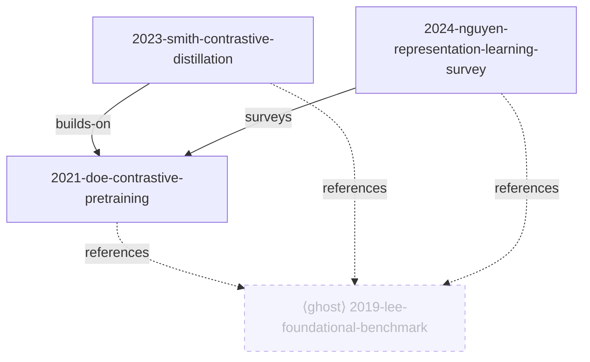

# Claude Research Agent

A replicable [Claude Code](https://claude.com/claude-code) workspace that turns a folder of paper PDFs into an organized, queryable research corpus. No app, no database, no embeddings — plain files plus agent conventions.

You have a folder of papers. You half-remember one of them reported the number you need — but not which, and grep over PDFs is useless. This workspace reads your papers once, organizes them, and then answers questions grounded in their actual text, with citations you can check.

Papers are organized into **corpora** — one folder per research area under `corpora/`. Each session opens a single corpus; organizing, answering, and mapping are all scoped to it.

## What it does

1. **Organizes:** dedupes your PDFs and renames each one exactly once, to a stable `YYYY-firstauthor-short-title` slug that never changes again. Each paper gets a cached text extraction and a structured card. The corpus gets `index.yaml`, the machine-readable source of truth, from which the human-readable views are generated. See [Layout](#layout).
2. **Answers questions grounded in YOUR papers,** with checkable citations (`[slug, §5.2]` + direct quotes), starting broad and drilling into fewer papers as you go deeper. If your papers don't cover it, it says so.
3. **Maps the neighborhood:** papers you have are **held**; papers your held papers cite but you don't have are **ghosts**. Ghosts are ranked by how many of your papers reference each one — a ready-made shortlist of what to add next. They fill in the map but can never ground a claim. Drop a ghost's PDF into the corpus's `papers/` and the next sync promotes it to held.

## What it looks like

Ask a question, get an answer that is willing to tell you the question has no clean answer. The papers below are invented for illustration; the shape of the answer is not.

```
You: is there a standard benchmark these papers all evaluate on?

Claude: No single accepted benchmark — and the corpus says so directly:

  > "the absence of standardized evaluation protocols, with top-1 accuracy reported
  >  under different augmentation budgets, hinders direct comparison"
  [2024-nguyen-representation-learning-survey, §3]

OpenVision-1M is the de facto shared *dataset* — 11 of your 14 papers train on it —
but it is common ground for training, not for evaluation. Two papers do report a
compute-matched number:

  • [2021-doe-contrastive-pretraining] — the base method
  • [2023-smith-contrastive-distillation] — adds a distillation term on top:
    > "…78.2% top-1, +2.1 over the Doe et al. baseline…" [§5.2]

Neither evaluates on the transfer suite of ⟨ghost:2019-lee-foundational-benchmark⟩,
which three of your papers cite but you do not hold. Supervised contrastive learning
is not covered in your papers.
```

Every quoted string in that answer is verifiable in seconds by grepping `text/`. Note the last two sentences: a pointer to a paper the corpus references but doesn't have, and a flat admission that one part of the question falls outside it.

The corpus map (`LANDSCAPE.md`) renders held papers solid and ghosts dashed:



The dashed node is a paper this corpus doesn't have. All three held papers cite it — exactly the signal that it belongs at the top of the reading list.

## Requirements

- [Claude Code](https://claude.com/claude-code)
- `pdftotext` from poppler: `brew install poppler` (macOS) / `apt install poppler-utils` (Linux)
- `python3` + PyYAML (`pip install pyyaml`) — used at ingestion to generate the corpus views. Asking questions needs neither.

## Quickstart

Click **"Use this template"** on GitHub to get your own copy (recommended), then:

```bash
git clone https://github.com/<you>/<your-repo>.git my-research && cd my-research
mkdir -p corpora/my-topic/papers
cp ~/Downloads/*.pdf corpora/my-topic/papers/
claude
```

Or clone this repo directly to try it: `git clone https://github.com/akhatami/claude-research-agent.git`.

Each research area is its own folder under `corpora/`. On session start, Claude lists your corpora and asks which one to open — a session works on exactly one. Run **`/sync`** to ingest: it shows a dry-run plan (renames + duplicate verdicts) for approval before touching any file, then extracts text, writes cards, and builds that corpus's index. After that, just ask questions — every answer is grounded in the open corpus.

`/sync` is incremental and safe to re-run. It identifies papers by content hash, so a second run only touches PDFs it hasn't seen. Add a corpus at any time with `mkdir -p corpora/another-topic/papers` — the first `/sync` in a bare corpus builds the rest of the skeleton itself.

## Layout

```
claude-research-agent/
├── CLAUDE.md                    # the agent's operating manual: scoping, routing, citation rules
├── .claude/
│   ├── settings.json            # registers the SessionStart hook
│   ├── hooks/select-corpus.sh   # lists corpora, asks which to open (reads no paper content)
│   └── skills/sync/SKILL.md     # /sync — the ingestion pipeline
├── scripts/
│   ├── generate_views.py        # deterministic renderer for INDEX.md and LANDSCAPE.md regions
│   └── tests/                   # golden-file tests: python3 -m unittest discover scripts/tests
├── docs/superpowers/            # design specs, plans, and undesigned ideas
└── corpora/                     # ↓ gitignored — your papers never leave your machine
    └── <your-topic>/
        ├── papers/              # you drop PDFs here; renamed once to a frozen slug
        ├── text/                # extracted plain text — the only layer that can ground a claim
        ├── notes/               # one card per paper — routes you to the right paper, never grounds
        ├── synthesis/           # long-form answers, auto-saved when one took real work
        ├── _duplicates/         # superseded versions; nothing is ever deleted
        ├── index.yaml           # machine truth: held papers, metadata, relations
        ├── refs.yaml            # machine truth: ghosts (cited by your papers, not held)
        ├── INDEX.md             # generated — overview table
        └── LANDSCAPE.md         # hybrid — written narrative + generated graph and ghost table
```

Only `papers/` is yours to fill. Everything else is derived, and some of it is derived *deterministically* — which is the point. A generated file is rewritten wholesale on the next `/sync`, so an edit you make there is an edit you lose:

| File | Written by | Safe to hand-edit? |
|---|---|---|
| `papers/*.pdf` | you | you drop them in; `/sync` renames once, then never again |
| `text/*.md` | `pdftotext` | no — re-extracted from the PDF |
| `notes/*.md` | Claude | yes |
| `synthesis/*.md` | Claude, after a deep answer | yes — they're yours to keep |
| `index.yaml` | Claude, during `/sync` | yes, carefully — it is the source of truth |
| `refs.yaml` | `/sync` ghost harvest | **never** |
| `INDEX.md` | `scripts/generate_views.py` | **never** — rewritten whole |
| `LANDSCAPE.md` | Claude (prose) + script (fenced regions) | prose yes; the `graph` and `ghosts` fences **never** |

Everything under `corpora/`, plus the `.active-corpus` marker, is gitignored. The repo carries only the machinery, so it can be reused for any number of paper sets.

## Why the citations are trustworthy

Three layers, and only one of them is allowed to answer:

- **`index.yaml` and `notes/`** are the *routing* layer. They narrow a question down to two or three candidate papers. Claude writes them, so they can drift.
- **`text/`** is the *grounding* layer. It is the paper, verbatim. Every quantitative claim is re-checked against it before you see it.
- **`refs.yaml`** holds the ghosts. A ghost may be named as the target of a relation your held paper asserts — "Smith compares against ⟨ghost:2019-lee-foundational-benchmark⟩" — because that sentence is grounded in Smith's own text. Any claim about what the *ghost itself* says gets the honest answer: "not in your papers (referenced only)."

The practical consequence is that every load-bearing claim arrives with a direct quote, so you can verify any citation by grepping `text/` without opening a PDF. And when your papers don't cover something, the answer says so. That is a required answer, not a failure.

## Syntheses

Some answers are cheap. Others make Claude read six papers end to end, or fan out subagents across the whole corpus. When an answer costs that much, it gets written to `<corpus>/synthesis/YYYY-MM-DD-topic.md` automatically — no prompting, no permission. The work outlives the session.

A synthesis opens with the question as you asked it and a one-line answer hedged exactly as far as the papers warrant, then argues the case with the same `[slug]` citations and quotes you saw in chat. It is a research memo you can hand to someone else.

It is also, deliberately, a *dead end* for grounding. A synthesis is written by Claude, so it sits at the same tier of trust as a card: it can drift, and it is never read back as evidence for a later question. Ask a follow-up and Claude re-derives the claim from `text/`, not from what it wrote last week. Syntheses accumulate for **you**, not for the agent.

## Guarantees

- Nothing is ever deleted; duplicates move to `_duplicates/`.
- Files are renamed exactly once, at ingestion, after your approval.
- Answers cite papers verifiably, or explicitly say the corpus doesn't cover the question.

## Known limitations

- **Scanned PDFs are not OCR'd.** They're flagged `needs-ocr`, still indexed from whatever text extracts, and any answer that relies on one discloses the limitation.
- **Ghost harvesting is only as good as the bibliography extracts.** Two-column reference lists, magazine sidebars, and unnumbered styles all degrade it, so a paper can contribute fewer ghost edges than it really cites.
- **Not every cited paper is worth chasing.** Generic-ML boilerplate shows up in the ghost ranking alongside genuinely foundational work; dismissing a ghost marks it `rejected` so it never resurfaces.

## Roadmap

Relations backfill (turning held→held citations found during ghost harvest into real graph edges), conversation capture, BibTeX/Zotero export, an interactive graph, and GROBID-based reference parsing for higher-accuracy bibliographies. The deterministic view and ghost-count generator has already shipped.

Design docs live in `docs/superpowers/specs/`; early, undesigned ideas in `docs/superpowers/ideas/`.

## License

MIT — see [LICENSE](LICENSE).
