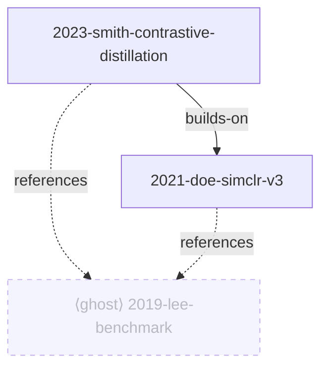

# Claude Research Agent

A replicable [Claude Code](https://claude.com/claude-code) workspace that turns a folder of paper PDFs into an organized, queryable research corpus. No app, no database, no embeddings — plain files plus agent conventions.

You have a folder of papers. You half-remember one of them reported the number you need — but not which, and grep over PDFs is useless. This workspace reads your papers once, organizes them, and then answers questions grounded in their actual text, with citations you can check.

Papers are organized into **corpora** — one folder per research area under `corpora/`. Each session opens a single corpus; organizing, answering, and mapping are all scoped to it.

## What it does

1. **Organizes:** dedupes, renames each paper once to a stable `YYYY-firstauthor-short-title` slug, extracts a text cache, writes a structured card per paper, and maintains `index.yaml` (the source of truth) → generated `INDEX.md` (overview table) and `LANDSCAPE.md` (the story of your corpus + a Mermaid relation graph).
2. **Answers questions grounded in YOUR papers,** with checkable citations (`[slug, §5.2]` + direct quotes), starting broad and drilling into fewer papers as you go deeper. If your papers don't cover it, it says so.
3. **Maps the neighborhood:** surfaces papers your held papers cite but you don't have yet as *ghosts* — ranked by how many of your papers reference each one, a ready-made shortlist of what to add next. Ghosts enrich the map but are never cited as grounding. Drop a ghost's PDF into the corpus's `papers/` and the next sync promotes it to a full paper.

## What it looks like

Ask a question, get a grounded answer:

```
You: which papers use a contrastive objective, and which reports the best result?

Claude: Two papers in your corpus use a contrastive objective:
  • [2021-doe-simclr-v3] — the base method (NT-Xent loss)
  • [2023-smith-contrastive-distillation] — adds a distillation term on top
Smith reports the stronger number:
  > "…78.2% top-1, +2.1 over the SimCLR baseline…" [2023-smith-contrastive-distillation, §5.2]
Supervised contrastive learning is not covered in your papers.
```

The corpus map (`LANDSCAPE.md`) renders held papers solid and ghosts dashed:



## Requirements

- [Claude Code](https://claude.com/claude-code)
- `pdftotext` from poppler: `brew install poppler` (macOS) / `apt install poppler-utils` (Linux)

## Quickstart

Click **"Use this template"** on GitHub to get your own copy (recommended), then:

```bash
git clone https://github.com/<you>/<your-repo>.git my-research && cd my-research
mkdir -p corpora/my-topic/papers
cp ~/Downloads/*.pdf corpora/my-topic/papers/
claude
```

Or clone this repo directly to try it: `git clone https://github.com/akhatami/claude-research-agent.git`.

Each research area is its own folder under `corpora/`. On session start, Claude lists your corpora and asks which one to open — a session works on exactly one. Run **`/sync`** to ingest: it shows a dry-run plan (renames + duplicate verdicts) for approval before touching any file, then extracts text, writes cards, and builds that corpus's index. After that, just ask questions — every answer is grounded in the open corpus.

## What stays local

Everything under `corpora/` — each corpus's `papers/`, `text/`, `notes/`, `_duplicates/`, `index.yaml`, `refs.yaml`, `INDEX.md`, `LANDSCAPE.md` — plus the `.active-corpus` marker is gitignored. The repo carries only the machinery, so it can be reused for any number of paper sets.

## Guarantees

- Nothing is ever deleted; duplicates move to `_duplicates/`.
- Files are renamed exactly once, at ingestion, after your approval.
- Answers cite papers verifiably, or explicitly say the corpus doesn't cover the question.

## Not in v1 (tracked)

- OCR for scanned PDFs — they're flagged `needs-ocr` and still indexed from whatever text extracts.
- BibTeX export, Zotero sync, interactive graph.
- Relations backfill — held→held citations discovered during ghost harvest becoming real graph edges.
- Relevance filtering of generic-ML ghosts — the `reject` flow is the v1 answer.

Design docs live in `docs/superpowers/specs/`.

## License

MIT — see [LICENSE](LICENSE).
