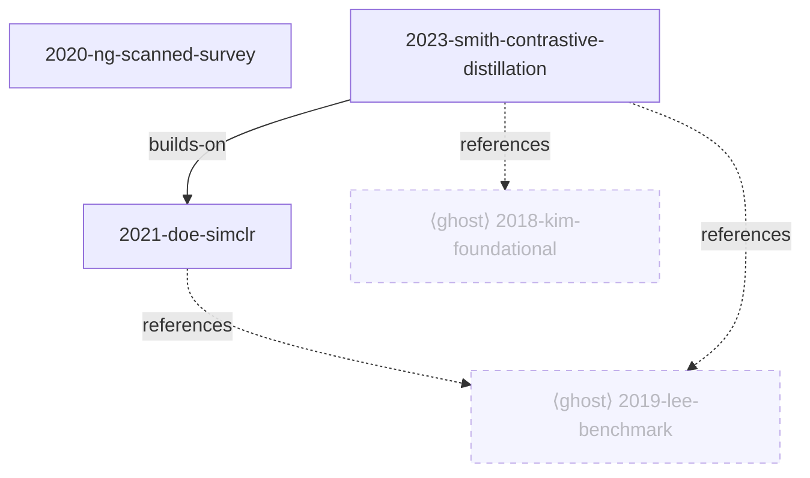

# Deterministic View & Ghost-Count Generator Implementation Plan

> **For agentic workers:** REQUIRED SUB-SKILL: Use superpowers:subagent-driven-development (recommended) or superpowers:executing-plans to implement this plan task-by-task. Steps use checkbox (`- [ ]`) syntax for tracking.

**Goal:** Move mechanical corpus-view rendering (INDEX.md, the LANDSCAPE Mermaid graph + ghost table) and all ghost count/threshold arithmetic out of the LLM into a deterministic, testable Python script.

**Architecture:** A single stdlib+PyYAML script, `scripts/generate_views.py <corpus-dir>`, reads `index.yaml` + `refs.yaml` and writes `INDEX.md` (whole file) plus two marker-fenced regions of `LANDSCAPE.md` (graph, ghosts), leaving the LLM-authored narrative untouched. All ordering is total, so re-runs are byte-identical. The sync skill gains a terminal Phase 6 that invokes it; the LLM keeps all judgment work.

**Tech Stack:** Python 3 (stdlib), PyYAML, stdlib `unittest`.

## Global Constraints

- Runtime: `python3` + PyYAML only. No third-party deps beyond PyYAML (no pytest — tests use stdlib `unittest`).
- The script is *the* renderer — no LLM fallback path.
- Output is **byte-identical** on re-run against unchanged YAML: every ordering has an explicit total sort key; no wall-clock timestamps in output.
- **Fail-closed:** malformed/incomplete YAML → non-zero exit, name the offending entry, **write nothing**.
- Machine files stay YAML; never migrate to JSON.
- Held papers only in `INDEX.md`; ghosts never appear there. Ghost citation marker in prose stays `⟨ghost:key⟩` (unchanged elsewhere).
- Ghost selection: keep iff `status != rejected` **and** (`len(cited_by) >= 2` **or** `status == pinned`). Graph draws at most the top **8** selected ghosts by pull.
- Committed machinery lives outside `corpora/` (which is gitignored): script at `scripts/`, tests at `scripts/tests/`.
- Commit messages end with the `Co-Authored-By: Claude Opus 4.8 <noreply@anthropic.com>` trailer.

---

## File Structure

**Create:**
- `scripts/generate_views.py` — the generator. One responsibility: pure-ish render of views from YAML, with I/O at the edges (`generate`, `main`).
- `scripts/tests/test_generate_views.py` — the `unittest` suite.
- `scripts/tests/fixtures/index.yaml` — fixture held papers.
- `scripts/tests/fixtures/refs.yaml` — fixture ghost candidates (above/below threshold, pinned, rejected).
- `scripts/tests/fixtures/expected_INDEX.md` — golden.
- `scripts/tests/fixtures/expected_graph.md` — golden graph-region content.
- `scripts/tests/fixtures/expected_ghosts.md` — golden ghost-table-region content.

**Modify:**
- `.claude/skills/sync/SKILL.md` — Phase 4 shrinks to narrative-only; Phase 5 stores all candidates; new terminal Phase 6 runs the generator; `refs.yaml` schema note; LANDSCAPE skeleton template; migration note.
- `CLAUDE.md` — honest "generated" wording naming the fenced regions.
- `README.md` — Requirements gains `python3` + `pyyaml`; "Not in v1" Python-offload line flips to shipped.

All tasks add functions to the single `scripts/generate_views.py`; each task's "Interfaces" block names the exact signatures neighboring tasks rely on.

**Test invocation (all tasks):** from the repo root —
```
python3 -m unittest discover -s scripts/tests -p 'test_*.py'
```
The test module inserts `scripts/` on `sys.path` so `import generate_views` works regardless of cwd.

---

### Task 1: Scaffolding — module, errors, YAML load + validation

**Files:**
- Create: `scripts/generate_views.py`
- Create: `scripts/tests/test_generate_views.py`
- Create: `scripts/tests/fixtures/index.yaml`
- Create: `scripts/tests/fixtures/refs.yaml`

**Interfaces:**
- Produces:
  - `class DependencyError(Exception)`, `class DataError(Exception)`
  - `load_yaml(path: str, default=None) -> object` — returns parsed YAML; missing file → `default`; `yaml is None` → raises `DependencyError`; parse error → raises `DataError`.
  - `validate_entries(entries: list) -> None` — raises `DataError` if any entry lacks `slug`, `title`, or `year`.
  - `validate_ghosts(ghosts: list) -> None` — raises `DataError` if any ghost lacks `key`.

- [ ] **Step 1: Create the two fixture YAML files**

`scripts/tests/fixtures/index.yaml`:
```yaml
- slug: 2023-smith-contrastive-distillation
  title: "Contrastive Distillation for Dense Retrieval"
  year: 2023
  venue: "NeurIPS 2023"
  tags: [contrastive-learning, distillation]
  summary: "Adds a distillation term on top of a contrastive objective."
  status: ok
  relations:
    - {to: 2021-doe-simclr, type: builds-on, why: "extends its objective"}
- slug: 2021-doe-simclr
  title: "SimCLR: A Simple Framework for Contrastive Learning"
  year: 2021
  venue: "ICML 2021"
  tags: [contrastive-learning]
  summary: "The base contrastive method (NT-Xent loss)."
  status: ok
- slug: 2020-ng-scanned-survey
  title: "A Survey of Scanned Representation Methods"
  year: 2020
  venue: "arXiv 2020"
  tags: [survey]
  summary: "Broad survey; scanned source."
  status: needs-ocr
```

`scripts/tests/fixtures/refs.yaml`:
```yaml
- key: 2019-lee-benchmark
  title: "A Large-Scale Benchmark for Representation Learning"
  year: 2019
  cited_by: [2023-smith-contrastive-distillation, 2021-doe-simclr]
  why: "the shared benchmark much of the corpus evaluates on"
  status: candidate
- key: 2018-kim-foundational
  title: "Foundational Method X"
  year: 2018
  cited_by: [2023-smith-contrastive-distillation]
  why: "foundational method the corpus builds on"
  status: pinned
  note: "kept as a foundational singleton"
- key: 2015-old-singleton
  title: "An Older Method"
  year: 2015
  cited_by: [2021-doe-simclr]
  why: "cited once"
  status: candidate
- key: 2017-generic-ml
  title: "Generic ML Trick"
  year: 2017
  cited_by: [2023-smith-contrastive-distillation, 2020-ng-scanned-survey]
  why: "too generic to promote"
  status: rejected
  note: "generic ML, dismissed"
```

- [ ] **Step 2: Write the failing test**

`scripts/tests/test_generate_views.py`:
```python
import os
import sys
import unittest

sys.path.insert(0, os.path.join(os.path.dirname(__file__), ".."))
import generate_views as gv  # noqa: E402

FIX = os.path.join(os.path.dirname(__file__), "fixtures")


def fixture(name):
    return os.path.join(FIX, name)


class LoadValidateTests(unittest.TestCase):
    def test_load_index_fixture(self):
        entries = gv.load_yaml(fixture("index.yaml"), default=[])
        self.assertEqual(len(entries), 3)
        self.assertEqual(entries[0]["slug"], "2023-smith-contrastive-distillation")

    def test_missing_file_returns_default(self):
        self.assertEqual(gv.load_yaml(fixture("does-not-exist.yaml"), default=[]), [])

    def test_dependency_error_when_yaml_missing(self):
        saved = gv.yaml
        gv.yaml = None
        try:
            with self.assertRaises(gv.DependencyError):
                gv.load_yaml(fixture("index.yaml"))
        finally:
            gv.yaml = saved

    def test_validate_entries_missing_slug(self):
        with self.assertRaises(gv.DataError):
            gv.validate_entries([{"title": "x", "year": 2020}])

    def test_validate_ghosts_missing_key(self):
        with self.assertRaises(gv.DataError):
            gv.validate_ghosts([{"title": "x"}])


if __name__ == "__main__":
    unittest.main()
```

- [ ] **Step 3: Run test to verify it fails**

Run: `python3 -m unittest discover -s scripts/tests -p 'test_*.py'`
Expected: FAIL — `ModuleNotFoundError: No module named 'generate_views'`.

- [ ] **Step 4: Write minimal implementation**

`scripts/generate_views.py`:
```python
#!/usr/bin/env python3
"""Generate deterministic corpus views (INDEX.md + LANDSCAPE.md fenced regions)
from index.yaml + refs.yaml.

Spec: docs/superpowers/specs/2026-07-09-view-generator-design.md
"""

import os
import sys

try:
    import yaml
except ImportError:
    yaml = None


class DependencyError(Exception):
    pass


class DataError(Exception):
    pass


def load_yaml(path, default=None):
    if yaml is None:
        raise DependencyError("PyYAML not installed — run `pip install pyyaml`")
    if not os.path.exists(path):
        return default
    with open(path, "r", encoding="utf-8") as f:
        try:
            data = yaml.safe_load(f)
        except yaml.YAMLError as exc:
            raise DataError("%s: invalid YAML — %s" % (path, exc))
    return default if data is None else data


def validate_entries(entries):
    for i, e in enumerate(entries):
        for field in ("slug", "title", "year"):
            if not e.get(field):
                label = e.get("slug") or ("entry #%d" % i)
                raise DataError("index.yaml %s: missing required field '%s'" % (label, field))


def validate_ghosts(ghosts):
    for i, g in enumerate(ghosts):
        if not g.get("key"):
            raise DataError("refs.yaml entry #%d: missing required field 'key'" % i)
```

- [ ] **Step 5: Run test to verify it passes**

Run: `python3 -m unittest discover -s scripts/tests -p 'test_*.py'`
Expected: PASS (5 tests).

- [ ] **Step 6: Commit**

```bash
git add scripts/generate_views.py scripts/tests/test_generate_views.py scripts/tests/fixtures/index.yaml scripts/tests/fixtures/refs.yaml
git commit -m "feat: view generator scaffolding — YAML load + validation

Co-Authored-By: Claude Opus 4.8 <noreply@anthropic.com>"
```

---

### Task 2: Render INDEX.md

**Files:**
- Modify: `scripts/generate_views.py` (add `escape_cell`, `fmt_tags`, `render_index`, `INDEX_BANNER`)
- Modify: `scripts/tests/test_generate_views.py` (add `RenderIndexTests`)
- Create: `scripts/tests/fixtures/expected_INDEX.md`

**Interfaces:**
- Consumes: `load_yaml`, fixture `index.yaml`.
- Produces:
  - `escape_cell(value) -> str` — `str(value)` with `|` → `\|` and newlines → spaces.
  - `fmt_tags(tags) -> str` — `", ".join(tags or [])`.
  - `render_index(entries: list) -> str` — full INDEX.md text (banner + table), rows sorted `year` desc then `slug` asc, trailing newline.

- [ ] **Step 1: Create the golden file**

`scripts/tests/fixtures/expected_INDEX.md` (note the trailing newline):
```
<!-- Generated from index.yaml — do not edit by hand. -->

# Corpus index

| slug | title | year | venue | tags | summary | status |
| --- | --- | --- | --- | --- | --- | --- |
| 2023-smith-contrastive-distillation | Contrastive Distillation for Dense Retrieval | 2023 | NeurIPS 2023 | contrastive-learning, distillation | Adds a distillation term on top of a contrastive objective. | ok |
| 2021-doe-simclr | SimCLR: A Simple Framework for Contrastive Learning | 2021 | ICML 2021 | contrastive-learning | The base contrastive method (NT-Xent loss). | ok |
| 2020-ng-scanned-survey | A Survey of Scanned Representation Methods | 2020 | arXiv 2020 | survey | Broad survey; scanned source. | needs-ocr |
```

- [ ] **Step 2: Write the failing test**

Add to `scripts/tests/test_generate_views.py`:
```python
class RenderIndexTests(unittest.TestCase):
    def test_render_index_matches_golden(self):
        entries = gv.load_yaml(fixture("index.yaml"), default=[])
        with open(fixture("expected_INDEX.md"), encoding="utf-8") as f:
            expected = f.read()
        self.assertEqual(gv.render_index(entries), expected)

    def test_escape_cell_pipes(self):
        self.assertEqual(gv.escape_cell("a|b"), "a\\|b")
```

- [ ] **Step 3: Run test to verify it fails**

Run: `python3 -m unittest discover -s scripts/tests -p 'test_*.py'`
Expected: FAIL — `AttributeError: module 'generate_views' has no attribute 'render_index'`.

- [ ] **Step 4: Write minimal implementation**

Add to `scripts/generate_views.py` (after the validators):
```python
INDEX_BANNER = "<!-- Generated from index.yaml — do not edit by hand. -->"


def escape_cell(value):
    return str(value).replace("|", "\\|").replace("\n", " ")


def fmt_tags(tags):
    return ", ".join(tags or [])


def render_index(entries):
    rows = sorted(entries, key=lambda e: (-int(e["year"]), e["slug"]))
    lines = [
        INDEX_BANNER,
        "",
        "# Corpus index",
        "",
        "| slug | title | year | venue | tags | summary | status |",
        "| --- | --- | --- | --- | --- | --- | --- |",
    ]
    for e in rows:
        lines.append("| %s | %s | %s | %s | %s | %s | %s |" % (
            escape_cell(e["slug"]),
            escape_cell(e["title"]),
            escape_cell(e["year"]),
            escape_cell(e.get("venue") or ""),
            escape_cell(fmt_tags(e.get("tags"))),
            escape_cell(e.get("summary") or ""),
            escape_cell(e.get("status") or "ok"),
        ))
    return "\n".join(lines) + "\n"
```

- [ ] **Step 5: Run test to verify it passes**

Run: `python3 -m unittest discover -s scripts/tests -p 'test_*.py'`
Expected: PASS (7 tests).

- [ ] **Step 6: Commit**

```bash
git add scripts/generate_views.py scripts/tests/test_generate_views.py scripts/tests/fixtures/expected_INDEX.md
git commit -m "feat: render INDEX.md from index.yaml

Co-Authored-By: Claude Opus 4.8 <noreply@anthropic.com>"
```

---

### Task 3: Ghost selection + ghost table

**Files:**
- Modify: `scripts/generate_views.py` (add `pull`, `select_ghosts`, `render_ghost_table`, `GHOST_HEADING`)
- Modify: `scripts/tests/test_generate_views.py` (add `GhostTests`)
- Create: `scripts/tests/fixtures/expected_ghosts.md`

**Interfaces:**
- Consumes: fixture `refs.yaml`.
- Produces:
  - `pull(ghost: dict) -> int` — `len(ghost.get("cited_by") or [])`.
  - `select_ghosts(ghosts: list) -> list` — keep iff `status != "rejected"` and (`pull >= 2` or `status == "pinned"`); sorted `pull` desc then `key` asc.
  - `render_ghost_table(selected: list) -> str` — table (heading + rows), or the literal `"No ghost papers yet."` when empty. `cited by` rendered as sorted, comma-joined. No trailing newline.

- [ ] **Step 1: Create the golden file**

`scripts/tests/fixtures/expected_ghosts.md` (no trailing blank line):
```
## Ghost papers — referenced but not held (promotion candidates)

| ghost | year | pull | status | cited by | why |
| --- | --- | --- | --- | --- | --- |
| 2019-lee-benchmark | 2019 | 2 | candidate | 2021-doe-simclr, 2023-smith-contrastive-distillation | the shared benchmark much of the corpus evaluates on |
| 2018-kim-foundational | 2018 | 1 | pinned | 2023-smith-contrastive-distillation | foundational method the corpus builds on |
```

- [ ] **Step 2: Write the failing test**

Add to `scripts/tests/test_generate_views.py`:
```python
class GhostTests(unittest.TestCase):
    def setUp(self):
        self.ghosts = gv.load_yaml(fixture("refs.yaml"), default=[])

    def test_select_applies_threshold_and_status(self):
        keys = [g["key"] for g in gv.select_ghosts(self.ghosts)]
        # 2019-lee (pull 2) kept; 2018-kim (pinned singleton) kept;
        # 2015-old-singleton (pull 1, candidate) dropped; 2017-generic-ml (rejected) dropped.
        self.assertEqual(keys, ["2019-lee-benchmark", "2018-kim-foundational"])

    def test_render_ghost_table_matches_golden(self):
        selected = gv.select_ghosts(self.ghosts)
        with open(fixture("expected_ghosts.md"), encoding="utf-8") as f:
            expected = f.read().rstrip("\n")
        self.assertEqual(gv.render_ghost_table(selected), expected)

    def test_empty_ghosts_message(self):
        self.assertEqual(gv.render_ghost_table([]), "No ghost papers yet.")
```

- [ ] **Step 3: Run test to verify it fails**

Run: `python3 -m unittest discover -s scripts/tests -p 'test_*.py'`
Expected: FAIL — `AttributeError: module 'generate_views' has no attribute 'select_ghosts'`.

- [ ] **Step 4: Write minimal implementation**

Add to `scripts/generate_views.py`:
```python
GHOST_HEADING = "## Ghost papers — referenced but not held (promotion candidates)"


def pull(ghost):
    return len(ghost.get("cited_by") or [])


def select_ghosts(ghosts):
    kept = [
        g for g in ghosts
        if g.get("status") != "rejected" and (pull(g) >= 2 or g.get("status") == "pinned")
    ]
    return sorted(kept, key=lambda g: (-pull(g), g["key"]))


def render_ghost_table(selected):
    if not selected:
        return "No ghost papers yet."
    lines = [
        GHOST_HEADING,
        "",
        "| ghost | year | pull | status | cited by | why |",
        "| --- | --- | --- | --- | --- | --- |",
    ]
    for g in selected:
        cited = ", ".join(sorted(g.get("cited_by") or []))
        lines.append("| %s | %s | %d | %s | %s | %s |" % (
            escape_cell(g["key"]),
            escape_cell(g.get("year") or ""),
            pull(g),
            escape_cell(g.get("status") or "candidate"),
            escape_cell(cited),
            escape_cell(g.get("why") or ""),
        ))
    return "\n".join(lines)
```

- [ ] **Step 5: Run test to verify it passes**

Run: `python3 -m unittest discover -s scripts/tests -p 'test_*.py'`
Expected: PASS (10 tests).

- [ ] **Step 6: Commit**

```bash
git add scripts/generate_views.py scripts/tests/test_generate_views.py scripts/tests/fixtures/expected_ghosts.md
git commit -m "feat: ghost selection (count/threshold) + promotion table

Co-Authored-By: Claude Opus 4.8 <noreply@anthropic.com>"
```

---

### Task 4: Render the Mermaid graph region

**Files:**
- Modify: `scripts/generate_views.py` (add `node_id`, `ghost_node_id`, `render_graph`, `GHOST_GRAPH_LIMIT`)
- Modify: `scripts/tests/test_generate_views.py` (add `GraphTests`)
- Create: `scripts/tests/fixtures/expected_graph.md`

**Interfaces:**
- Consumes: fixtures `index.yaml`, `refs.yaml`; `select_ghosts`.
- Produces:
  - `node_id(slug: str) -> str` — `"n_" + slug.replace("-", "_")`.
  - `ghost_node_id(key: str) -> str` — `"ghost_" + key.replace("-", "_")`.
  - `render_graph(entries: list, selected_ghosts: list) -> str` — a fenced ```mermaid``` block. No trailing newline.
- Ordering: held nodes by `slug` asc; held edges (only where `to` is a held slug) by `(from, to, type)`; ghost nodes = top `GHOST_GRAPH_LIMIT` selected, declared by `key` asc; ghost `references` edges grouped by ghost `key` asc, each ghost's held citers sorted asc, capped at 3; then `classDef ghost` and a single `class …` line (drawn ghost ids by `key` asc). Emit `classDef`/`class` only if ≥1 ghost drawn.

- [ ] **Step 1: Create the golden file**

`scripts/tests/fixtures/expected_graph.md`:
````

````
(The golden file's own content is the fenced block above — its first line is ` ```mermaid ` and its last line is ` ``` `.)

- [ ] **Step 2: Write the failing test**

Add to `scripts/tests/test_generate_views.py`:
```python
class GraphTests(unittest.TestCase):
    def test_render_graph_matches_golden(self):
        entries = gv.load_yaml(fixture("index.yaml"), default=[])
        ghosts = gv.select_ghosts(gv.load_yaml(fixture("refs.yaml"), default=[]))
        with open(fixture("expected_graph.md"), encoding="utf-8") as f:
            expected = f.read().rstrip("\n")
        self.assertEqual(gv.render_graph(entries, ghosts), expected)

    def test_node_ids_are_hyphen_free(self):
        self.assertEqual(gv.node_id("2021-doe-simclr"), "n_2021_doe_simclr")
        self.assertEqual(gv.ghost_node_id("2019-lee-benchmark"), "ghost_2019_lee_benchmark")

    def test_graph_without_ghosts_has_no_classdef(self):
        entries = gv.load_yaml(fixture("index.yaml"), default=[])
        out = gv.render_graph(entries, [])
        self.assertNotIn("classDef ghost", out)
```

- [ ] **Step 3: Run test to verify it fails**

Run: `python3 -m unittest discover -s scripts/tests -p 'test_*.py'`
Expected: FAIL — `AttributeError: module 'generate_views' has no attribute 'render_graph'`.

- [ ] **Step 4: Write minimal implementation**

Add to `scripts/generate_views.py`:
```python
GHOST_GRAPH_LIMIT = 8


def node_id(slug):
    return "n_" + slug.replace("-", "_")


def ghost_node_id(key):
    return "ghost_" + key.replace("-", "_")


def render_graph(entries, selected_ghosts):
    held_slugs = {e["slug"] for e in entries}
    lines = ["```mermaid", "graph TD"]

    for e in sorted(entries, key=lambda e: e["slug"]):
        lines.append('    %s["%s"]' % (node_id(e["slug"]), e["slug"]))

    edges = []
    for e in entries:
        for rel in (e.get("relations") or []):
            to = rel.get("to")
            if to in held_slugs:
                edges.append((e["slug"], to, rel.get("type") or ""))
    for frm, to, typ in sorted(edges):
        lines.append("    %s -->|%s| %s" % (node_id(frm), typ, node_id(to)))

    drawn = sorted(selected_ghosts[:GHOST_GRAPH_LIMIT], key=lambda g: g["key"])
    for g in drawn:
        lines.append('    %s["⟨ghost⟩ %s"]' % (ghost_node_id(g["key"]), g["key"]))
    for g in drawn:
        citers = [c for c in sorted(g.get("cited_by") or []) if c in held_slugs][:3]
        for c in citers:
            lines.append("    %s -. references .-> %s" % (node_id(c), ghost_node_id(g["key"])))
    if drawn:
        lines.append("    classDef ghost stroke-dasharray:5 5,opacity:0.55;")
        ids = ",".join(ghost_node_id(g["key"]) for g in drawn)
        lines.append("    class %s ghost;" % ids)

    lines.append("```")
    return "\n".join(lines)
```

- [ ] **Step 5: Run test to verify it passes**

Run: `python3 -m unittest discover -s scripts/tests -p 'test_*.py'`
Expected: PASS (13 tests).

- [ ] **Step 6: Commit**

```bash
git add scripts/generate_views.py scripts/tests/test_generate_views.py scripts/tests/fixtures/expected_graph.md
git commit -m "feat: render deterministic Mermaid relation graph with ghost nodes

Co-Authored-By: Claude Opus 4.8 <noreply@anthropic.com>"
```

---

### Task 5: Marker-region replacement + self-heal

**Files:**
- Modify: `scripts/generate_views.py` (add `replace_region`)
- Modify: `scripts/tests/test_generate_views.py` (add `RegionTests`)

**Interfaces:**
- Produces: `replace_region(text: str, name: str, content: str) -> (str, bool)` — replaces the text between `<!-- BEGIN GENERATED:{name} -->` and `<!-- END GENERATED:{name} -->` with `begin\ncontent\nend`. If BEGIN is absent, appends the fenced block after a blank line and returns `appended=True`. If BEGIN is present but END is missing, raises `DataError`.

- [ ] **Step 1: Write the failing test**

Add to `scripts/tests/test_generate_views.py`:
```python
class RegionTests(unittest.TestCase):
    def test_replace_existing_region_preserves_surroundings(self):
        text = (
            "# Title\n\nNarrative stays.\n\n"
            "<!-- BEGIN GENERATED:graph -->\nold\n<!-- END GENERATED:graph -->\n\nAfter.\n"
        )
        out, appended = gv.replace_region(text, "graph", "NEW")
        self.assertFalse(appended)
        self.assertIn("Narrative stays.", out)
        self.assertIn("After.", out)
        self.assertIn(
            "<!-- BEGIN GENERATED:graph -->\nNEW\n<!-- END GENERATED:graph -->", out
        )
        self.assertNotIn("old", out)

    def test_missing_region_is_appended_and_flagged(self):
        text = "# Title\n\nNarrative only.\n"
        out, appended = gv.replace_region(text, "ghosts", "TBL")
        self.assertTrue(appended)
        self.assertIn("Narrative only.", out)
        self.assertIn(
            "<!-- BEGIN GENERATED:ghosts -->\nTBL\n<!-- END GENERATED:ghosts -->", out
        )

    def test_unterminated_region_raises(self):
        text = "<!-- BEGIN GENERATED:graph -->\nno end marker\n"
        with self.assertRaises(gv.DataError):
            gv.replace_region(text, "graph", "X")
```

- [ ] **Step 2: Run test to verify it fails**

Run: `python3 -m unittest discover -s scripts/tests -p 'test_*.py'`
Expected: FAIL — `AttributeError: module 'generate_views' has no attribute 'replace_region'`.

- [ ] **Step 3: Write minimal implementation**

Add to `scripts/generate_views.py`:
```python
def replace_region(text, name, content):
    begin = "<!-- BEGIN GENERATED:%s -->" % name
    end = "<!-- END GENERATED:%s -->" % name
    block = "%s\n%s\n%s" % (begin, content, end)
    start = text.find(begin)
    if start == -1:
        return text.rstrip("\n") + "\n\n" + block + "\n", True
    stop = text.find(end, start)
    if stop == -1:
        raise DataError("LANDSCAPE.md: region '%s' has BEGIN but no END marker" % name)
    return text[:start] + block + text[stop + len(end):], False
```

- [ ] **Step 4: Run test to verify it passes**

Run: `python3 -m unittest discover -s scripts/tests -p 'test_*.py'`
Expected: PASS (16 tests).

- [ ] **Step 5: Commit**

```bash
git add scripts/generate_views.py scripts/tests/test_generate_views.py
git commit -m "feat: in-place marker-region replacement with self-heal

Co-Authored-By: Claude Opus 4.8 <noreply@anthropic.com>"
```

---

### Task 6: Orchestration — `generate()` + `main()`, integration, idempotence, fail-closed

**Files:**
- Modify: `scripts/generate_views.py` (add `LANDSCAPE_SKELETON`, `generate`, `main`, `__main__` guard)
- Modify: `scripts/tests/test_generate_views.py` (add `IntegrationTests`)

**Interfaces:**
- Consumes: everything above.
- Produces:
  - `LANDSCAPE_SKELETON: str` — new-file template: a title, an authoring note, a `## The story of this corpus` narrative placeholder, and both empty marker fences.
  - `generate(corpus_dir: str) -> list[str]` — loads + validates YAML, renders, writes `INDEX.md` whole and both LANDSCAPE regions; returns the list of region names that were appended (self-healed). All rendering happens before any write (fail-closed).
  - `main(argv: list[str]) -> int` — arg parsing + exit codes: usage/dir errors → `2`; `DependencyError`/`DataError` → `1` (nothing written); success → `0`.

- [ ] **Step 1: Write the failing test**

Add to `scripts/tests/test_generate_views.py` (top-level import additions and class):
```python
import shutil
import tempfile


class IntegrationTests(unittest.TestCase):
    def setUp(self):
        self.tmp = tempfile.mkdtemp()
        self.addCleanup(shutil.rmtree, self.tmp)
        shutil.copy(fixture("index.yaml"), os.path.join(self.tmp, "index.yaml"))
        shutil.copy(fixture("refs.yaml"), os.path.join(self.tmp, "refs.yaml"))

    def _seed_landscape(self, with_ghosts_fence=True):
        parts = [
            "# Corpus landscape\n\n## The story of this corpus\n\n",
            "Two papers form a contrastive-learning cluster.\n\n",
            "<!-- BEGIN GENERATED:graph -->\nstale\n<!-- END GENERATED:graph -->\n\n",
        ]
        if with_ghosts_fence:
            parts.append("<!-- BEGIN GENERATED:ghosts -->\nstale\n<!-- END GENERATED:ghosts -->\n")
        with open(os.path.join(self.tmp, "LANDSCAPE.md"), "w", encoding="utf-8") as f:
            f.write("".join(parts))

    def test_generate_writes_index_and_regions(self):
        self._seed_landscape()
        warnings = gv.generate(self.tmp)
        self.assertEqual(warnings, [])
        with open(fixture("expected_INDEX.md"), encoding="utf-8") as f:
            self.assertEqual(open(os.path.join(self.tmp, "INDEX.md"), encoding="utf-8").read(), f.read())
        land = open(os.path.join(self.tmp, "LANDSCAPE.md"), encoding="utf-8").read()
        self.assertIn("Two papers form a contrastive-learning cluster.", land)
        self.assertIn("graph TD", land)
        self.assertIn("2019-lee-benchmark", land)
        self.assertNotIn("stale", land)

    def test_generate_is_idempotent(self):
        self._seed_landscape()
        gv.generate(self.tmp)
        first_index = open(os.path.join(self.tmp, "INDEX.md"), encoding="utf-8").read()
        first_land = open(os.path.join(self.tmp, "LANDSCAPE.md"), encoding="utf-8").read()
        gv.generate(self.tmp)
        self.assertEqual(open(os.path.join(self.tmp, "INDEX.md"), encoding="utf-8").read(), first_index)
        self.assertEqual(open(os.path.join(self.tmp, "LANDSCAPE.md"), encoding="utf-8").read(), first_land)

    def test_missing_ghosts_fence_self_heals(self):
        self._seed_landscape(with_ghosts_fence=False)
        warnings = gv.generate(self.tmp)
        self.assertEqual(warnings, ["ghosts"])

    def test_malformed_yaml_writes_nothing(self):
        # Unterminated double-quoted scalar → a real YAML parse error → DataError.
        with open(os.path.join(self.tmp, "index.yaml"), "w", encoding="utf-8") as f:
            f.write('- slug: x\n  title: "unterminated\n')
        self._seed_landscape()
        rc = gv.main(["generate_views.py", self.tmp])
        self.assertEqual(rc, 1)
        self.assertFalse(os.path.exists(os.path.join(self.tmp, "INDEX.md")))

    def test_main_usage_error(self):
        self.assertEqual(gv.main(["generate_views.py"]), 2)
```

- [ ] **Step 2: Run test to verify it fails**

Run: `python3 -m unittest discover -s scripts/tests -p 'test_*.py'`
Expected: FAIL — `AttributeError: module 'generate_views' has no attribute 'generate'`.

- [ ] **Step 3: Write minimal implementation**

Add to `scripts/generate_views.py`:
```python
LANDSCAPE_SKELETON = (
    "# Corpus landscape\n\n"
    "<!-- The narrative below is authored by the assistant; the fenced\n"
    "     regions are generated — do not edit them by hand. -->\n\n"
    "## The story of this corpus\n\n"
    "_(narrative pending — the assistant writes this)_\n\n"
    "<!-- BEGIN GENERATED:graph -->\n<!-- END GENERATED:graph -->\n\n"
    "<!-- BEGIN GENERATED:ghosts -->\n<!-- END GENERATED:ghosts -->\n"
)


def generate(corpus_dir):
    index_path = os.path.join(corpus_dir, "index.yaml")
    refs_path = os.path.join(corpus_dir, "refs.yaml")
    landscape_path = os.path.join(corpus_dir, "LANDSCAPE.md")
    index_out = os.path.join(corpus_dir, "INDEX.md")

    entries = load_yaml(index_path, default=[]) or []
    validate_entries(entries)
    ghosts = load_yaml(refs_path, default=[]) or []
    validate_ghosts(ghosts)
    selected = select_ghosts(ghosts)

    # Render everything BEFORE writing anything (fail-closed).
    index_md = render_index(entries)
    graph_md = render_graph(entries, selected)
    ghosts_md = render_ghost_table(selected)

    if os.path.exists(landscape_path):
        with open(landscape_path, encoding="utf-8") as f:
            land = f.read()
    else:
        land = LANDSCAPE_SKELETON

    warnings = []
    land, app_graph = replace_region(land, "graph", graph_md)
    if app_graph:
        warnings.append("graph")
    land, app_ghosts = replace_region(land, "ghosts", ghosts_md)
    if app_ghosts:
        warnings.append("ghosts")

    with open(index_out, "w", encoding="utf-8") as f:
        f.write(index_md)
    with open(landscape_path, "w", encoding="utf-8") as f:
        f.write(land)
    return warnings


def main(argv):
    if len(argv) != 2:
        print("usage: generate_views.py <corpus-dir>", file=sys.stderr)
        return 2
    corpus_dir = argv[1]
    if not os.path.isdir(corpus_dir):
        print("error: not a directory: %s" % corpus_dir, file=sys.stderr)
        return 2
    try:
        warnings = generate(corpus_dir)
    except (DependencyError, DataError) as exc:
        print("error: %s" % exc, file=sys.stderr)
        return 1
    for name in warnings:
        print("warning: appended missing generated region '%s' to LANDSCAPE.md" % name,
              file=sys.stderr)
    print("generated INDEX.md and LANDSCAPE.md regions for %s" % corpus_dir)
    return 0


if __name__ == "__main__":
    sys.exit(main(sys.argv))
```

- [ ] **Step 4: Run test to verify it passes**

Run: `python3 -m unittest discover -s scripts/tests -p 'test_*.py'`
Expected: PASS (21 tests).

- [ ] **Step 5: Manual smoke test against the fixture**

Run:
```bash
mkdir -p /tmp/vg-smoke && cp scripts/tests/fixtures/index.yaml scripts/tests/fixtures/refs.yaml /tmp/vg-smoke/
python3 scripts/generate_views.py /tmp/vg-smoke && cat /tmp/vg-smoke/INDEX.md
```
Expected: prints the generated confirmation line; `INDEX.md` matches the golden; a fresh `LANDSCAPE.md` was created from the skeleton with both regions filled (two `warning:` lines about appended regions are expected on this first run since the skeleton path is only used when the file is absent — here the file is absent, so regions come from the skeleton and are *replaced*, not appended, i.e. **no** warnings). Clean up: `rm -rf /tmp/vg-smoke`.

- [ ] **Step 6: Commit**

```bash
git add scripts/generate_views.py scripts/tests/test_generate_views.py
git commit -m "feat: generate() orchestration + CLI (idempotent, fail-closed)

Co-Authored-By: Claude Opus 4.8 <noreply@anthropic.com>"
```

---

### Task 7: Wire the generator into the sync skill

**Files:**
- Modify: `.claude/skills/sync/SKILL.md`

No automated test — verification is inspection + `grep`. This task is independently reviewable: a reviewer can accept the code (Tasks 1–6) but reject the skill wording, or vice-versa.

- [ ] **Step 1: Rewrite Phase 4 (regenerate) to narrative-only**

Replace the current Phase 4 body (the two numbered items that have the LLM render `C/INDEX.md` and `C/LANDSCAPE.md`) with:

```markdown
## Phase 4 — Regenerate (narrative only)

The mechanical views are no longer hand-written here — they are produced by `scripts/generate_views.py` in Phase 6. Phase 4 is now judgment-only:

1. **`C/LANDSCAPE.md` narrative.** Author (or update) the narrative region only: the corpus story — thematic clusters (from tags/relations), what each cluster solves, how clusters connect, where the open tensions/gaps are. Narrative prose, not bullets-only. Do NOT hand-write the Mermaid graph or the ghost table; those are generated fenced regions Phase 6 fills.
   - **First sync of a corpus:** create `C/LANDSCAPE.md` from this skeleton (the generator will fill the fences in Phase 6):

     ```markdown
     # Corpus landscape

     <!-- The narrative below is authored by the assistant; the fenced
          regions are generated — do not edit them by hand. -->

     ## The story of this corpus

     <narrative>

     <!-- BEGIN GENERATED:graph -->
     <!-- END GENERATED:graph -->

     <!-- BEGIN GENERATED:ghosts -->
     <!-- END GENERATED:ghosts -->
     ```
   - **Migrating an existing corpus (one-time):** if `C/LANDSCAPE.md` still has an un-fenced hand-written graph and ghost table, delete those two blocks from the narrative body and insert the two empty marker fences where they belong. The narrative prose is preserved verbatim.
2. Report orphans and any `needs-ocr` / `metadata-unverified` statuses in the final summary (unchanged).
```

- [ ] **Step 2: Update Phase 5 selection + write steps to store all candidates**

In Phase 5, change step 5 (**Select**) and step 8 (**Write**) so the threshold is no longer applied when writing `refs.yaml`:

- Replace step 5's text with:
  ```markdown
  5. **Record all candidates.** Do NOT apply the promotion threshold here — that is now the generator's job. Every surviving group is written to `C/refs.yaml` with its full `cited_by` list and a curation `status`. (Selection for the view — `count ≥ 2` or `pinned`, excluding `rejected` — is applied deterministically by `scripts/generate_views.py`, so an LLM miscount can never corrupt the ranking.)
  ```
- In step 7 (**Enrich**), change "above-threshold ghosts only" to: "ghosts with `len(cited_by) ≥ 2` or `status: pinned` (this count is for choosing enrichment targets only; the generator remains the authority for the view)."
- Replace step 8's "then render the ghost surfaces into `C/LANDSCAPE.md`" clause so Phase 5 only writes `C/refs.yaml`; rendering of the ghost table and ghost graph nodes moves to Phase 6.

- [ ] **Step 3: Add Phase 6 (generate) as the terminal phase**

After Phase 5, add:

```markdown
## Phase 6 — Generate views (terminal, deterministic)

Runs last, after `C/index.yaml` and `C/refs.yaml` are final. Renders all mechanical views deterministically — the LLM writes none of them.

Run: `python3 scripts/generate_views.py C` (where `C = corpora/<active-corpus>`).

It writes `C/INDEX.md` whole and fills the `graph` and `ghosts` fenced regions of `C/LANDSCAPE.md`, leaving the narrative untouched.

- **Prerequisite:** `python3` + PyYAML. If it exits with "PyYAML not installed", tell the user to run `pip install pyyaml` and stop — do not hand-render as a fallback.
- **Fail-closed:** if it exits non-zero on malformed/incomplete YAML, fix the offending entry it names and re-run; never emit a hand-written view instead.
- Include its confirmation (and any self-heal warnings) in the final sync summary.
```

- [ ] **Step 4: Update the `refs.yaml` schema note**

In the "refs.yaml entry schema" section, update the `status` comment and surrounding prose to state that `refs.yaml` stores **all** grouped candidates (including sub-threshold singletons), and that `scripts/generate_views.py` applies the `count ≥ 2`-or-`pinned`-minus-`rejected` selection at render time. Keep `count = len(cited_by)` described as always-derived.

- [ ] **Step 5: Verify wording is consistent**

Run:
```bash
grep -n "generate_views.py" .claude/skills/sync/SKILL.md
grep -n "BEGIN GENERATED" .claude/skills/sync/SKILL.md
grep -n "Phase 6" .claude/skills/sync/SKILL.md
```
Expected: the generator invocation appears in Phase 6; the skeleton shows both fences; Phase 6 is referenced. Confirm no remaining instruction tells the LLM to hand-render `INDEX.md`, the graph, or the ghost table.

- [ ] **Step 6: Commit**

```bash
git add .claude/skills/sync/SKILL.md
git commit -m "feat: sync skill — Phase 6 runs the view generator; Phase 4/5 judgment-only

Co-Authored-By: Claude Opus 4.8 <noreply@anthropic.com>"
```

---

### Task 8: Update CLAUDE.md + README.md

**Files:**
- Modify: `CLAUDE.md`
- Modify: `README.md`

No automated test — verification is inspection + `grep`.

- [ ] **Step 1: Make CLAUDE.md's "generated" wording honest**

In `CLAUDE.md`, update the file-discipline paragraph that says `INDEX.md` and `LANDSCAPE.md` are "generated from index.yaml … never hand-edit them; regenerate via the sync skill" to reflect the split precisely:
- `INDEX.md` is generated whole by `scripts/generate_views.py`.
- `LANDSCAPE.md` is a hybrid: the assistant authors the narrative; the `graph` and `ghosts` **fenced regions** are generated by the script and must not be hand-edited.
Keep the existing rule that both are regenerated through `/sync` (now its Phase 6).

- [ ] **Step 2: Update README Requirements**

In `README.md` under **Requirements**, add a line after the `pdftotext` bullet:
```markdown
- `python3` + PyYAML (`pip install pyyaml`) — used at ingestion to generate the corpus views. Asking questions needs neither.
```

- [ ] **Step 3: Flip the "Not in v1" Python-offload line**

In `README.md` under **Not in v1 (tracked)**, remove the line:
```markdown
- Python offload for deterministic work (view + ghost-count generation) to cut token cost.
```
The remaining Python escalation (GROBID reference/metadata parsing) is not yet shipped; if desired, replace the removed line with:
```markdown
- Python offload for *reference/metadata parsing* (GROBID) — the heavier accuracy escalation; the view + ghost-count generator has shipped.
```

- [ ] **Step 4: Verify**

Run:
```bash
grep -n "pyyaml" README.md
grep -n "fenced region" CLAUDE.md
grep -n "Python offload for deterministic work" README.md
```
Expected: `pyyaml` present in Requirements; CLAUDE.md mentions the fenced regions; the old "deterministic work" Not-in-v1 line is gone.

- [ ] **Step 5: Commit**

```bash
git add CLAUDE.md README.md
git commit -m "docs: document the view generator (CLAUDE.md discipline, README requirements)

Co-Authored-By: Claude Opus 4.8 <noreply@anthropic.com>"
```

---

## Self-Review

**1. Spec coverage** — every spec section maps to a task:
- Ownership boundary → Tasks 2 (INDEX), 3 (ghost arithmetic + table), 4 (graph); LLM-owned narrative preserved by Task 5's region replacement.
- `refs.yaml` semantics change (store all candidates; script applies threshold) → Task 3 (`select_ghosts`) + Task 7 Steps 2 & 4.
- The script (location, explicit corpus arg, whole-file INDEX + in-place LANDSCAPE, total ordering) → Tasks 4–6.
- Marker mechanism + self-heal → Task 5; bootstrap skeleton → Task 6 (`LANDSCAPE_SKELETON`) + Task 7 Step 1.
- Sync integration (Phases 4/5/6) → Task 7.
- Migration (one-time per corpus) → Task 7 Step 1.
- Error handling (fail-closed, PyYAML message, refs.yaml absent, missing fence) → Tasks 1, 5, 6.
- Testing (fixtures, goldens, idempotence, threshold, fail-closed, self-heal) → Tasks 1–6.
- Doc updates → Task 8.
- Success criteria 1–6 → covered by Tasks 6 (idempotence, fail-closed), 3 (ranking by construction), 5 (narrative survives), 7 (zero mechanical output in sync).

**2. Placeholder scan** — no "TBD/TODO/handle appropriately"; every code step shows complete code; the only literal `pending`/`<narrative>` tokens are intentional template placeholder *content* in the LANDSCAPE skeleton.

**3. Type consistency** — names are stable across tasks: `load_yaml`, `validate_entries`/`validate_ghosts`, `escape_cell`, `render_index`, `pull`, `select_ghosts`, `render_ghost_table`, `node_id`/`ghost_node_id`, `render_graph`, `replace_region` (returns `(str, bool)`), `generate` (returns `list[str]` of appended region names), `main` (returns int exit code). Marker names `graph`/`ghosts` and the `n_`/`ghost_` id prefixes are used identically in Tasks 4, 5, 6 and the goldens.
