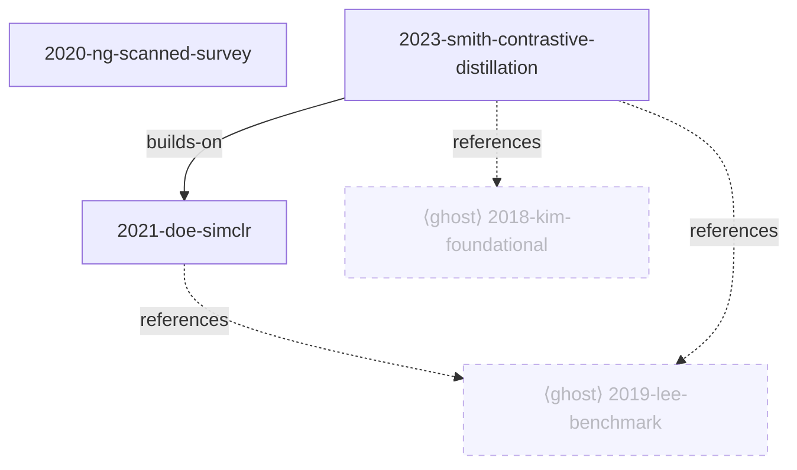

```mermaid
graph TD
    n_2020_ng_scanned_survey["2020-ng-scanned-survey"]
    n_2021_doe_simclr["2021-doe-simclr"]
    n_2023_smith_contrastive_distillation["2023-smith-contrastive-distillation"]
    n_2023_smith_contrastive_distillation -->|builds-on| n_2021_doe_simclr
    ghost_2018_kim_foundational["⟨ghost⟩ 2018-kim-foundational"]
    ghost_2019_lee_benchmark["⟨ghost⟩ 2019-lee-benchmark"]
    n_2023_smith_contrastive_distillation -. references .-> ghost_2018_kim_foundational
    n_2021_doe_simclr -. references .-> ghost_2019_lee_benchmark
    n_2023_smith_contrastive_distillation -. references .-> ghost_2019_lee_benchmark
    classDef ghost stroke-dasharray:5 5,opacity:0.55;
    class ghost_2018_kim_foundational,ghost_2019_lee_benchmark ghost;
```